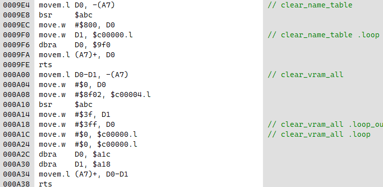

# What is This?
Sega Genesis/MegaDrive assembly code examples from articles on [namelessalgorithm.com](https://namelessalgorithm.com/genesis/).

# Prerequisites
1. Compile VASM assembler for both MC68000 and Z80 as explained in [the article 'SEGA Genesis: Building a ROM'](https://namelessalgorithm.com/genesis/blog/genesis/).
2. Ensure that MC68000 assembler is named `vasm.exe` and Z80 assembler is named `vasmZ80.exe`. Both files should be placed in [bin/](bin/).
3. Open example dir and run `assemble.bat`.
4. Load ROM from [roms/](roms/) in your favourite emulator.

# Examples
- **Very Minimal**: Minimal Sega Genesis ROM.
  [Article: 'SEGA Genesis: Building a ROM'](https://namelessalgorithm.com/genesis/blog/genesis/)
  
  
  
  [Source code](src/very_minimal/very_minimal.asm) | [Download ROM](roms/very_minimal.gen?raw=true)

- **Hello**: Hello world text demo.
  [Article: 'SEGA Genesis: Printing Text'](https://namelessalgorithm.com/genesis/blog/text/).
  
  
  
  [Source code](src/hello_world/hello.asm) | [Download ROM](roms/hello.gen?raw=true)

- **MAME Debug**: MAME Debug example.
  [Article: 'SEGA Genesis: Debugging'](https://namelessalgorithm.com/genesis/blog/debug/).
  
  
  
  [MAME label Ruby script](scripts/mamelabels-vasm.rb)

# Copyright and License
All source code in this repository has the following copyright:
```
Copyright 2022 Nameless Algorithm
See https://namelessalgorithm.com/ for more information.
```
And the following license:
```
You may use this source code for any purpose. If you do so, please attribute
'Nameless Algorithm' in your source, or mention us in your game/demo credits.
Thank you.
```

# Thanks
In no particular order:
- Matt Phillips for the BigEvilCorporation tutorials
- iwis for Plutiedev
- MarkeyJester for MC68000 tutorials
- Flint/DARKNESS for MC 680x0 Reference 1.1
- Alexey Melnikov/sorgelig for the MiSTer
- Gregory Estrade for the fpgagen Sega Genesis/MegaDrive FPGA core
- Mednafen Team for a great emulator
- Sonic Retro/Sega Retro Team for segaretro.org and the Sonic disassembly (s1disasm)
- Dr. Volker Barthelmann for vasm
